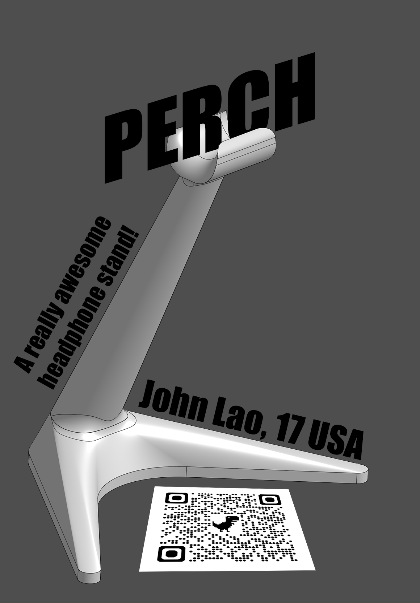
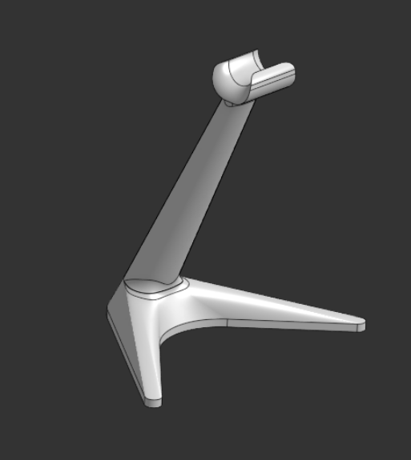
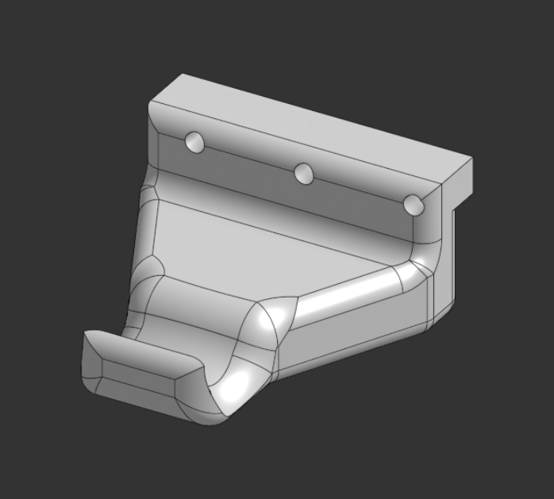
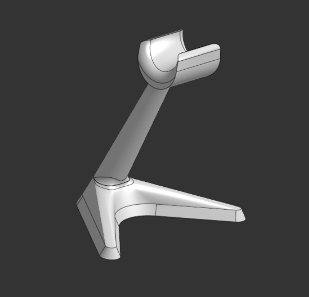

# Perch
A simple headphone stand to put on a desk (but it looks really cool). Under desk and on desk (also a large version for desktop) variations!

Checkout the onshape! : https://cad.onshape.com/documents/75131810aca125db5f16127b/w/5e17b4d02fd494d68057785d/e/f459fe825815cc1a91250b69 

## Use
Plop on desk (or use 1/4-20 bolts to attach to desk rail), put headphone band in the lego hand looking thing.

if you don't have a desk rail, use some double sided tape or glue. Make sure it's the strong stuff!

## HOW?

Snap it together, or install under desk, and slap those headphones on top

## John. WHY?

I need a headphone stand. No of the ones I saw online looked cool. Like remotely. So, I decided to make one. I hope other people can also use this as a cool stand!

## Images

